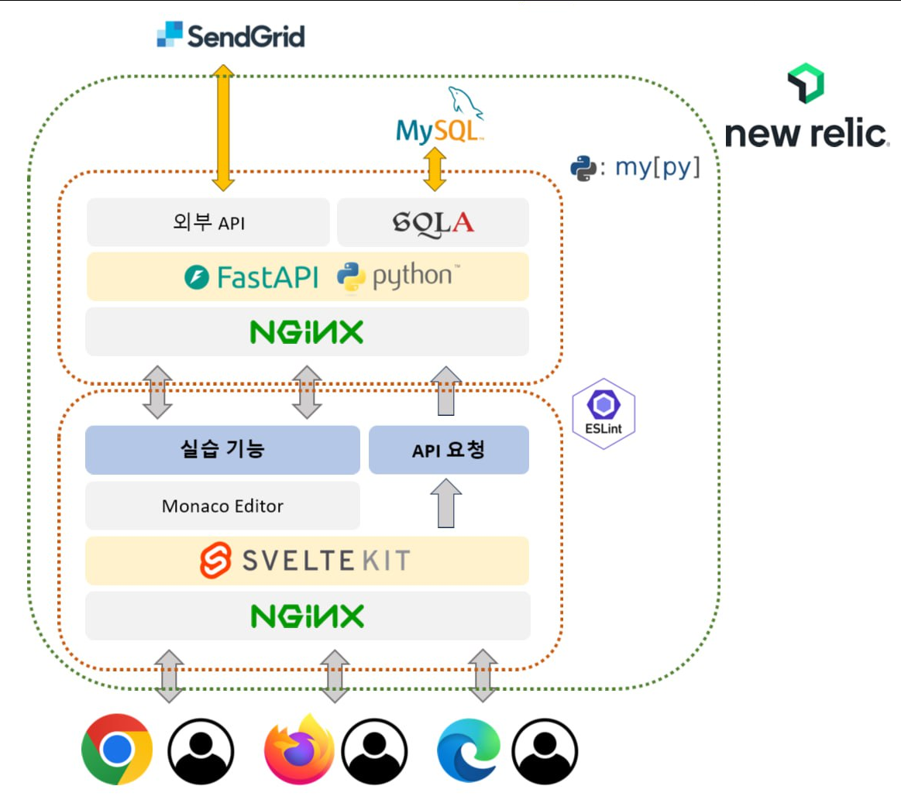

# KuKu

---

-   온라인 저지 및 코드 학습을 위한 플랫폼 개발
-   교내 열정학기제 프로젝트
-   코드를 작성할 수 있는 알고리즘 학습 사이트

## 개발 기간

---

-   2022년 09월 03일 ~ 2022년 11월 22일
    -   아이디어 선정
    -   개발 환경 구축
    -   각 파트 인원 할당 및 개발 시작
    -   중간 보고 및 주간 레포트 작성
    -   docker기반 코드 데몬 추가
    -   알고리즘 컨텐츠 추가
    -   최종 발표

## 팀원

---

-   이석민 : PM, Rust 코드 데몬 개발
-   한다운 : Frontend 매니저
-   주병규 : Backend 매니저
-   전유림 : Frontend 개발
-   김준서 : FullStack 개발
-   하민우 : FullStack 개발, 컨텐츠 제작 개발

## 아키텍쳐

---

## 시연 내용

---

### 발표자료용 Docx Paper

